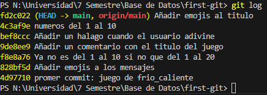

# Taller Git y GitHub

Nombre: Alejandra Maria Acevedo Gutierrez

Este taller trata de un juego en JS para adivinar un número del 1 al 10, mostrando si esta "Frío" o "Caliente" según va adivinando, con Commits donde se cambian ciertas cosas pequeñas del codigo y se van como guardando en una base, y queda un historial para saber los cambios que se realizaron al juego.

## Historial de commits

